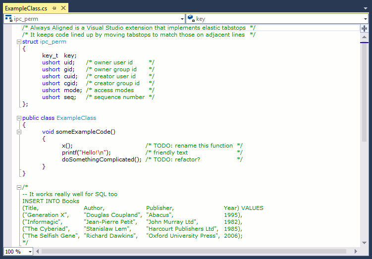

# Always Aligned VS

**Stop wasting time manually lining up code.**

Elastic tabstops are a fundamentally better way of handling text. Now you can use them in Visual Studio.

Elastic tabstops mean programmers just use one tab between columns rather than inserting the exact number of spaces/tabs on each line in the buffer to make things line up. Always Aligned brings elastic tabstops to Visual Studio while still allowing users to work with code that doesn't use them.

## Notes

* After installation, change Visual Studio's settings to use tabs instead of spaces.

* Consider adding elastic tabstops to your code standard to minimise whitespace changes in your version control system. Alternatively, if your code standard uses spaces, make sure you enable Always Aligned's "Convert to/from space based files" setting.

